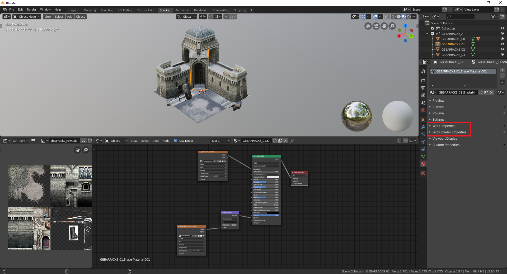
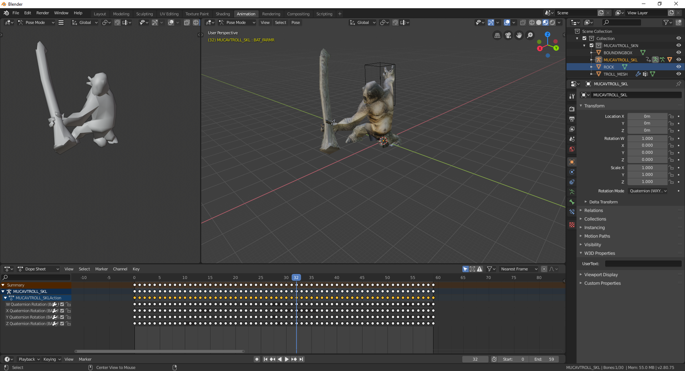

As we've already announced in our latest post, we're working on a **W3D Blender Plugin**. We strongly believe that modding is a big part of SAGE being such a succesful engine over the years, which is why we want to contribute tools back to the community.

You might already know that Westwood 3D (W3D) is the 3D format used in the first games created with the SAGE engine (later on replaced by an XML-based version called W3X). One big issue with the format used to be the lack of tools that allow authoring of these files. The official modding SDKs included plugins for Autodesk 3ds Max of the era - however, the issue is that Autodesk 3ds Max is a commercial tool and the official plugins are not compatible with modern versions of it. Apart from this it was lacking some features the community desperately needs, like the import of compressed animations.

As the result of this we decided to write an open source Blender plugin, which adds support for exporting and importing of W3D files. Our existing W3D code from OpenSAGE was a big advantage, since it serves as the most comprehensive documentation available for the format.

# Why Blender

With the latest major Blender 2.8 release it became the first choice for open source 3D modelling software. Big companies like Epic, NVIDIA, AMD and Ubisoft have decided to fund the development of Blender. Due to the open Python API it's also easy to write plugins that interact with the software.

# How it works

*This walkthrough assumes you know how Blender works and how to use it*

To start using the plugin you can download the latest version from our GitHub page, which can be found [here](https://github.com/OpenSAGE/OpenSAGE.BlenderPlugin/releases). Through the preferences window you can select the zip archive to be installed. The import and export submenus now contain entries for the `*.w3d` format.
During the import of a model it's important that all referenced files (skeleton & textures) can be found, so they must be in the same folder as the file you want to import.

## General

Let's start by importing a simple structure, like the Gondor Barracks from Battle for Middle-earth:

The model as you can see it in the screenshot above is in it's default state. As you can see in the scene collection on the right the plugin creates a parent collection for all meshes that are part of the `W3D` file. Since materials in Blender 2.8 are completely node-based, the plugin automatically creates a node based shader setup that matches the material specified in the model. See below for the barracks shader node setup, which uses a diffuse and a normal texture.

Since there are many material options which are specific to `W3D`, we added two new property groups to the material section of each object. These groups are required to set advanced options of the Westwood3D format, which are quite specific to the SAGE game engine. So these options are only used for the exported file and have no effect in Blender itself.

## Skinned models

Let's continue by importing a simple skinned model, like the Cave Troll from Battle for Middle-earth:

So let's take a closer look at what happened here. During import the skeleton is automatically loaded and applied to the mesh (in the scene collection it's named `MUCAVTROLL_SKL`). The pose that you can now see is the so called **rest pose**, which means no animation is applied to the hierarchy.

## Animation

If we want to add an animation we need to load the separate animation file, e.g. the attack animation (`mucavtroll_atkg.w3d`). The animation is automatically applied to the base model of the troll. Unfortunately there is a keyframe created for each frame in most cases due to the animation compression technique used in W3D.

## Export

Exporting W3D models is a tricky, because meshes, skeletons and animations should get split in separate files. During the export the user must configure the export options accordingly.

## Render

Another cool usage of Blender is of course that it includes great rendering capabilities, so this plugin could also be used for this purpose.

    <iframe width="560" height="315" src="https://www.youtube.com/embed/qazn4JlNm3Q" frameborder="0" gesture="media" allow="encrypted-media" allowfullscreen></iframe>

We are happy to hear your feedback about the new Blender W3D plugin!
