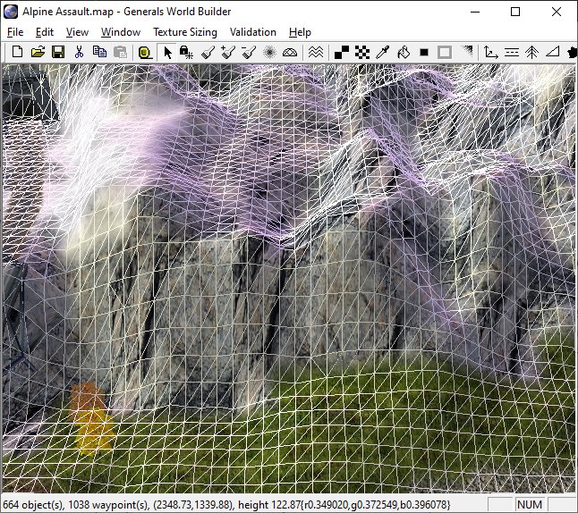
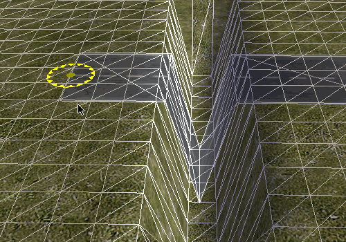
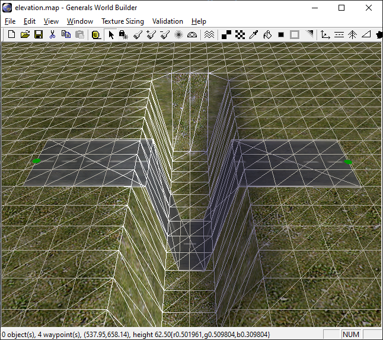
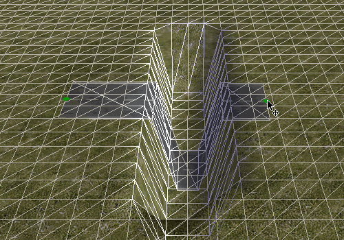
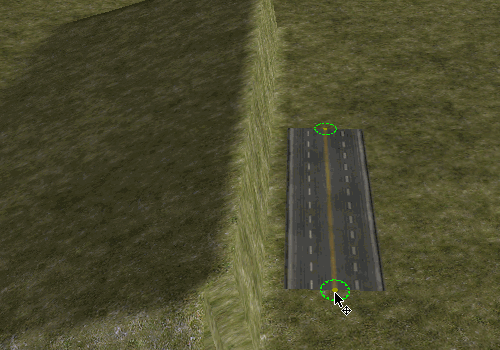
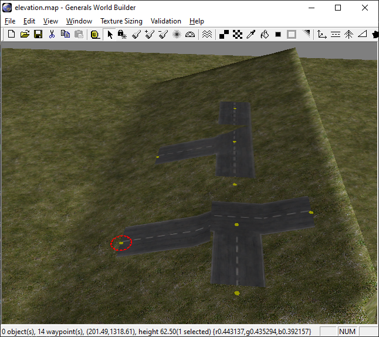
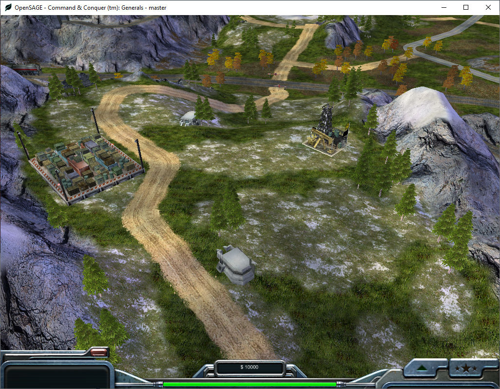

Figuring out how to render the roads correctly in OpenSAGE turned out to be a little more challenging than expected. This is the tenth post in a series describing the journey.

We are now able to render [straight](/blog/roads-how-boring-part-4-rendering-straight-roads) and [curved](/blog/roads-how-boring-part-9-rendering-curves) roads as well as [crossings](/blog/roads-how-boring-part-7-rendering-crossings). But there's one thing we ignored so far: the terrain. Until now, we assumed that the roads exist in a plane, but of course that's not the case in most of the maps. 

## The heightmap

The terrain is defined by a [heightmap](https://en.wikipedia.org/wiki/Heightmap). The world is divided into squares of 10 feet length and the height of each vertex of this grid is given by the heightmap:

## Dividing the road segments

It's not easy to derive how exactly the roads behave in such a smooth environment though, where there are hardly any flat surfaces, so let's instead investigate some extreme situations like this steep gap:

As you can see in the animation, the road texture does not follow the terrain exactly. There is a little margin between the road and the slope. This changes when we slightly modify the road segment's start position:

World Builder's wireframe mode comes to the rescue once more: It seems that the algorithm walks along the road segment from start to end position and queries the heightmap every 10 feet. Once the height is different to the previous value, a new quad is created. This leads to the road going down into the gap, but then up again immediately. If we increase the gap width to two tiles, we get a short horizontal part in the middle (and a total of five sub-segments):

But there's more that we can learn from this gap: Let's see what happens when we make the road cross it diagonally.

The horizontal part does not gradually move up the slope. Instead the road vertices are either placed at the bottom or at the top. Apparently the algorithm does not calculate the exact height but just determines the corresponding tile and then uses the maximum height of all its vertices. This is probably a good idea anyway, otherwise the road could easily vanish under slightly uneven terrain.

There's one more caveat: It's not enough to consider the terrain height in the middle of the road. Depending on the road width, multiple positions have to be checked (again, every 10 feet) and then the maximum height is used for both vertices at the left and right edge of the road. This can lead to strange artifacts when roads are placed along slopes, but there's no way this situation would look right anyway:

So this is our final algorithm:

* Start at the road segment's start position
* Move towards the end position in steps of 10 feet
    * At each step S
        * Move towards the left and right edge of the road in steps of 10 feet
            * Determine the tile the position is on
            * Get height of the four vertices defining the tile
        * Use the maximum of these heights as the height of position S

Now we know the height of the road every 10 steps and we can generate the quads for the sub-segments: Whenever the height at position S is different from the interpolated height between S - 1 and S + 1, start a new quad.

## Curves and crossings

We can use the same algorithm to subdivide the quads for curves and crossings. The only difference is that for crossings, there's no obvious start and end position, but it just seems to be hard-coded which positions are used (left to right in texture space). Therefore the orientation of the crossing determines how it adjusts to the slope:

Then again, both version have problems. The roads in SAGE just aren't meant to be put along slopes in the first place.

But ignoring such edge cases, our solution does look quite nice ingame:

We're almost done now! In the next (and last) chapter of this series, we will talk about the end caps.

