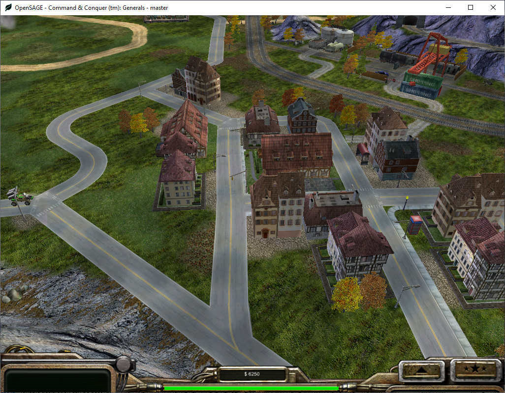

Figuring out how to render the roads correctly in OpenSAGE turned out to be a little more challenging than expected...and to be honest, so has writing this series of blog posts! 

* [Part 1: Taking stock](/blog/roads-how-boring-part-1-taking-stock)
* [Part 2: Inspecting the map file](/blog/roads-how-boring-part-2-inspecting-the-map-file)
* [Part 3: Building a graph data structure](/blog/roads-how-boring-part-3-building-a-graph-data-structure)
* [Part 4: Rendering straight roads](/blog/roads-how-boring-part-4-rendering-straight-roads)
* [Part 5: Connecting the road segments](/blog/roads-how-boring-part-5-connecting-the-road-segments)
* [Part 6: Choosing a crossing type](/blog/roads-how-boring-part-6-choosing-a-crossing-type)
* [Part 7: Rendering crossings](/blog/roads-how-boring-part-7-rendering-crossings)
* [Part 8: Rendering crossings (continued)](/blog/roads-how-boring-part-8-rendering-crossings-continued)
* [Part 9: Rendering curves](/blog/roads-how-boring-part-9-rendering-curves)
* [Part 10: Considering the terrain](/blog/roads-how-boring-part-10-considering-the-terrain)
* [Part 11: Rendering end caps](/blog/roads-how-boring-part-11-rendering-end-caps)
* [Part 12: Summing up (this post)](/blog/roads-how-boring-part-12-summing-up)

Wow...I never thought it would take eleven posts. They turned out a lot more detailed than I had originally planned them, but that way they hopefully also serve as documentation.
I also found two or three bugs while going through the code again :)

Thank you for reading this far! I hope you enjoyed it and I could show you that roads are not quite as boring as the GLA rocket buggy driver thinks.

Last but not least, I want to thank my soon-to-be wife Birgit, without whose help I couldn't have possibly figured out all the necessary geometry!