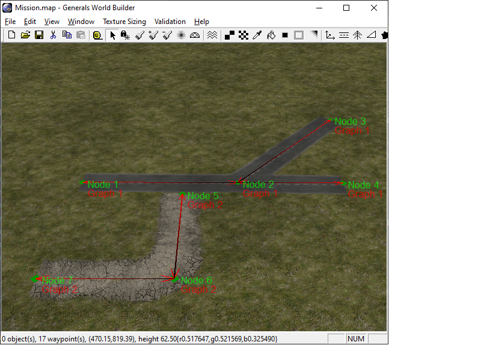
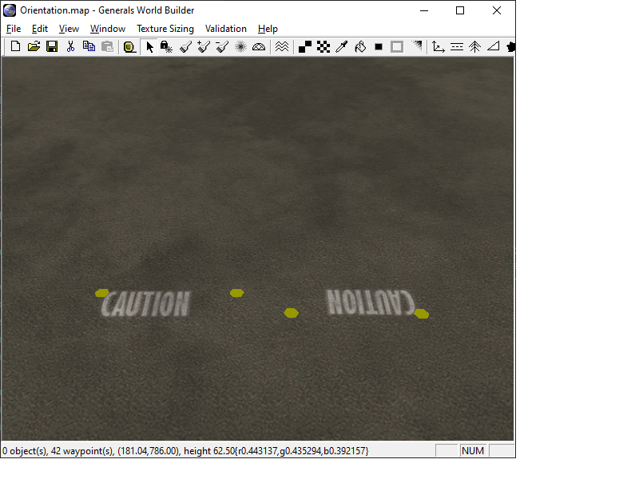
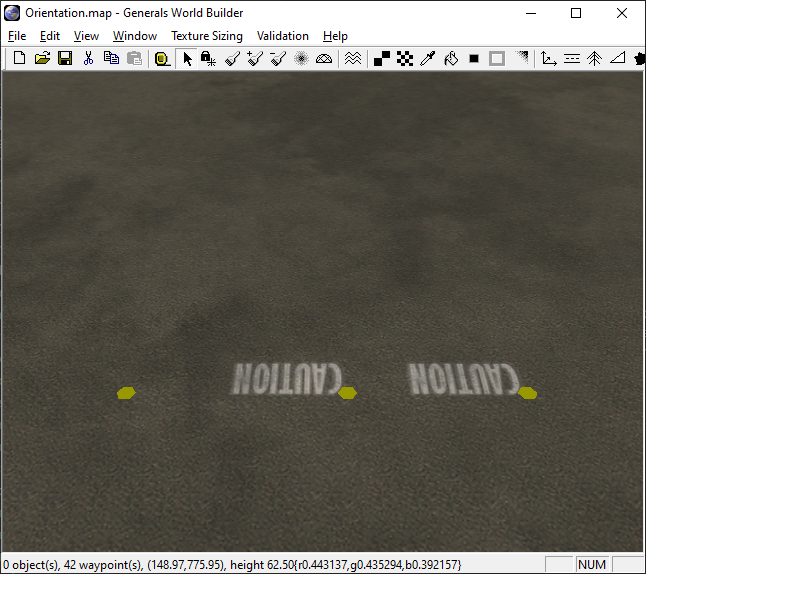
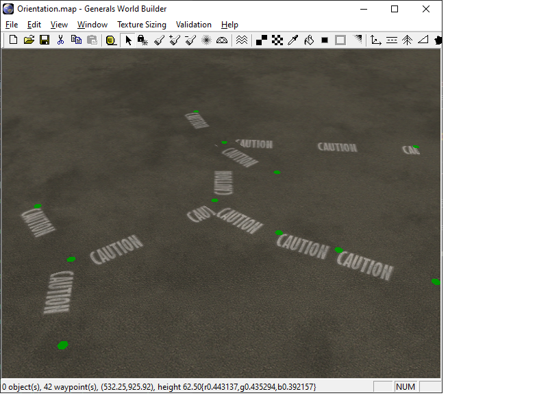
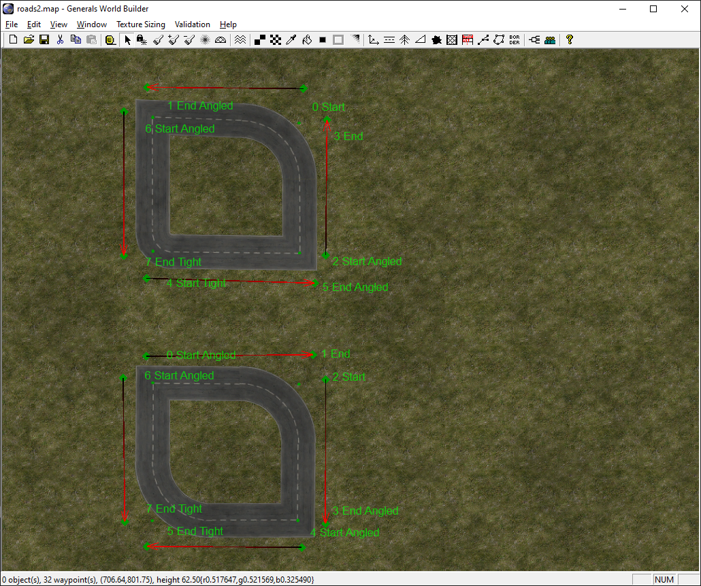

Figuring out how to render the roads correctly in OpenSAGE turned out to be a little more challenging than expected. This is the third post in a series describing the journey. [Last time](/blog/roads-how-boring-part-2-inspecting-the-map-file) we found out that the map files only store start and end positions for the road segments, but no information about their connections.

In order to decide which textures we have to draw, we need to build a graph data structure with _nodes_ and _edges_. That way we can use the number of edges and the angles between them for each node to select a texture for the crossing or curve.

For our test map, this is what the graphs should look like:



Each node knows its position and the adjacent edges. Each edge knows its adjacent nodes. The following C# classes are used for building this data structure:

```csharp
internal sealed class RoadTopologyNode
{
    public Vector3 Position { get; }
    public List<RoadTopologyEdge> Edges { get; } = new List<RoadTopologyEdge>();

    // ...
}

internal sealed class RoadTopologyEdge
{
    public RoadTemplate Template { get; }

    public RoadTopologyNode Start { get; private set; }
    public RoadType StartType { get; private set; }

    public RoadTopologyNode End { get; private set; }
    public RoadType EndType { get; private set; }

    // ...
}
```

We create the graphs by creating a _RoadTopologyEdge_ for every pair of points in the map file. For both endpoints, we either create a new _RoadTopologyNode_, or we reuse an existing one if we already created one at *exactly* the same location and with the same type (roads of different types are never connected):

```csharp
public void AddSegment(RoadTemplate template, MapObject start, MapObject end)
{
    var startNode = GetOrCreateNode(start.Position);
    var endNode = GetOrCreateNode(end.Position);

    // Edge case handling omitted for brevity (pun maybe intended)

    var edge = new RoadTopologyEdge(
        template,
        startNode,
        start.RoadType,
        endNode,
        end.RoadType,
        Edges.Count);

    Edges.Add(edge);

    startNode.Edges.Add(edge);
    endNode.Edges.Add(edge);
}
```

## Road alignment

Before we can put our graph data structure to use, there's one more thing we need to consider. In original SAGE, connected road segments are automatically aligned so that the left and right edges of the texture are on the same side for both segments. While this is hardly noticable for normal roads, there are some road types for markings on the ground which contain written words on transparent background:



By default, each texture is drawn from the segment's start to its end point, which is why the right one is head first. When we connect the two road segments however, the left segment is rotated by 180 degrees so the two segments are aligned:



But how does the engine decide which segment should be rotated? What happens when more than two segments are connected? What about cyclic graphs?

It took a lot of experimenting with complex graphs like this one to figure it out:



* Edges created earlier are aligned to edges created later on (this is why in the example above, the left edge is rotated as it was created first).
* At nodes with more than two edges, the second newest edge is aligned to the newest one. All others are ignored.
* When an edge is added to a graph, the whole graph's alignment is reevaluated. This means that the newest edge in a graph determines the aligment of all other edges.

In order to implement that, we need to know an edge's age. Apparently new edges are added to a map at the front of the object list, so we can use an edge's index in the list as its age. We also have to know if an edge was already aligned to another edge, so we added two properties to the `RoadTopologyEdge` class:

```csharp
public int Index { get; }
public int AlignedLikeIndex { get; set; } = -1;
```

Then we can implement the alignment like this:

```csharp
/// <summary>
/// Aligns the orientation of connected road segments so that textures with
/// text on them are rotated the same way.
/// </summary>
public void AlignOrientation()
{
    // Basically, edges with higher indices are rotated to match edges with 
    // lower indices.
    // This is a bit counter-intuitive, as it is opposed to the creation order 
    // (the edge that was created first is the last in the list and vice versa.

    // At crossings, the second edge is rotated to match the first edge.
    // All other edges are not affected.
    foreach (var edge in Edges)
    {
        // If we already aligned this edge, skip to the next.
        if (edge.AlignedLikeIndex >= 0)
            continue;
        
        edge.AlignedLikeIndex = edge.Index;

        // Walk along connected edges in both directions,
        // aligning them to the current edge.
        WalkEdges(edge, edge.Start);
        WalkEdges(edge, edge.End);

        void WalkEdges(
          RoadTopologyEdge currentEdge,
          RoadTopologyNode currentNode)
        {
            // Get the next edge connected to the current one via currentNode.
            var nextEdge = GetNextEdge(currentEdge, currentNode);

            while (nextEdge != null)
            {
                // Align the next edge by swapping the end points if necessary.
                nextEdge.AlignedLikeIndex = currentEdge.AlignedLikeIndex;
                if (nextEdge.Start.Position == currentEdge.Start.Position ||
                    nextEdge.End.Position == currentEdge.End.Position)
                {
                    nextEdge.SwapEndpoints();
                }

                // Continue along the path.
                currentEdge = nextEdge;
                currentNode = currentNode == currentEdge.Start ? 
                  currentEdge.End : 
                  currentEdge.Start;
                nextEdge = GetNextEdge(currentEdge, currentNode);
            }
        }
    }

    RoadTopologyEdge GetNextEdge(RoadTopologyEdge edge, RoadTopologyNode node)
    {
        // If there is only one edge, we have reached the end of the path.
        if (node.Edges.Count > 1)
        {
            // If edge is the first edge, ...
            if (edge == node.Edges[0])
            {
                // ... and the second edge is not yet aligned, we can move
                // along the second edge...
                if (node.Edges[1].AlignedLikeIndex < 0)
                {
                    return node.Edges[1];
                }
            }
            else if (edge == node.Edges[1])
            {
                // ...and vice versa.
                if (node.Edges[0].AlignedLikeIndex < 0)
                {
                    return node.Edges[0];
                }
            }
        }

        // No more edges along this path.
        return null;
    }
}
```

## Swapping the endpoints

You might have noticed that the actual alignment is done by the method `SwapEndpoints`, which does exactly what its name suggests:

```csharp
public void SwapEndpoints()
{
    var temp = Start;
    Start = End;
    End = temp;

    // This is actually a bug in the original engine:
    // We should swap StartType and EndType as well,
    // but then we couldn't recreate the original behavior.

    // var tempType = StartType;
    // StartType = EndType;
    // EndType = tempType;
}
```

As you can tell from the comment, there seems to be a bug in the original engine. Normally, when two segment are connected, their endpoints are merged into one. We can then set the corner type for this node as described in [part 1](/blog/roads-how-boring-part-1-taking-stock). This road type is then stored redundantly in both map objects that make up the two end points of the two edges. When we swap the end points of one of the edges (but not their road types), it can happen that the two edges disagree about the corner type. This can also be seen in World Builder:



The labels show the corner types of the segment end points, the arrows show the segment directions (start to end). In the lower graph, one edge has an opposing direction and thus is rotated by the alignment algorithm. This causes the lower left corner to be incorrectly rendered as a broad curve (the default value), even though both edges say it should be a tight curve.

We'll have to keep that in mind for when we start rendering curves. Before we can do that though, we need to render straight road segments. In fact, we'll start doing that in the [next post](/blog/roads-how-boring-part-4-rendering-straight-roads).