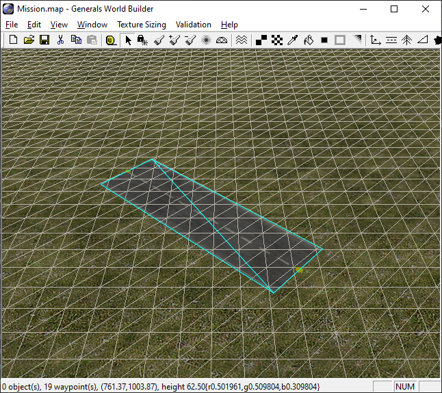
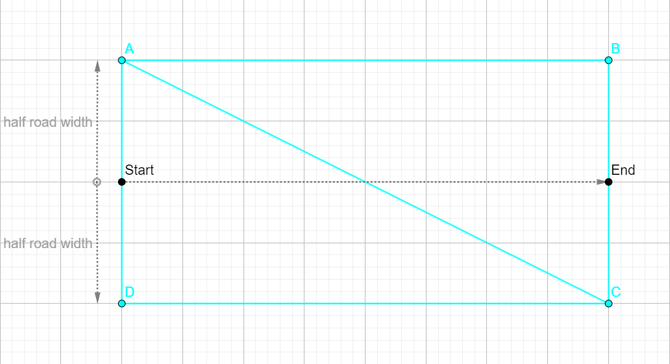
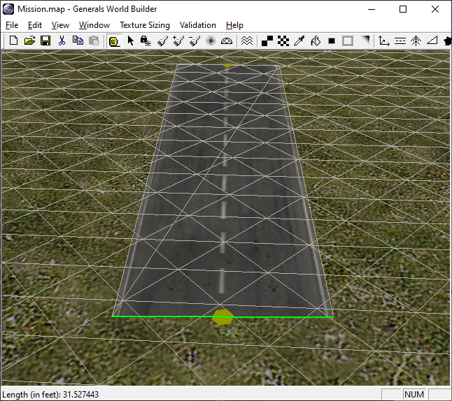
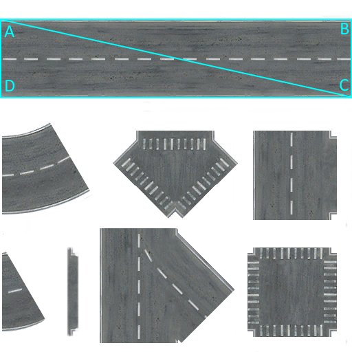
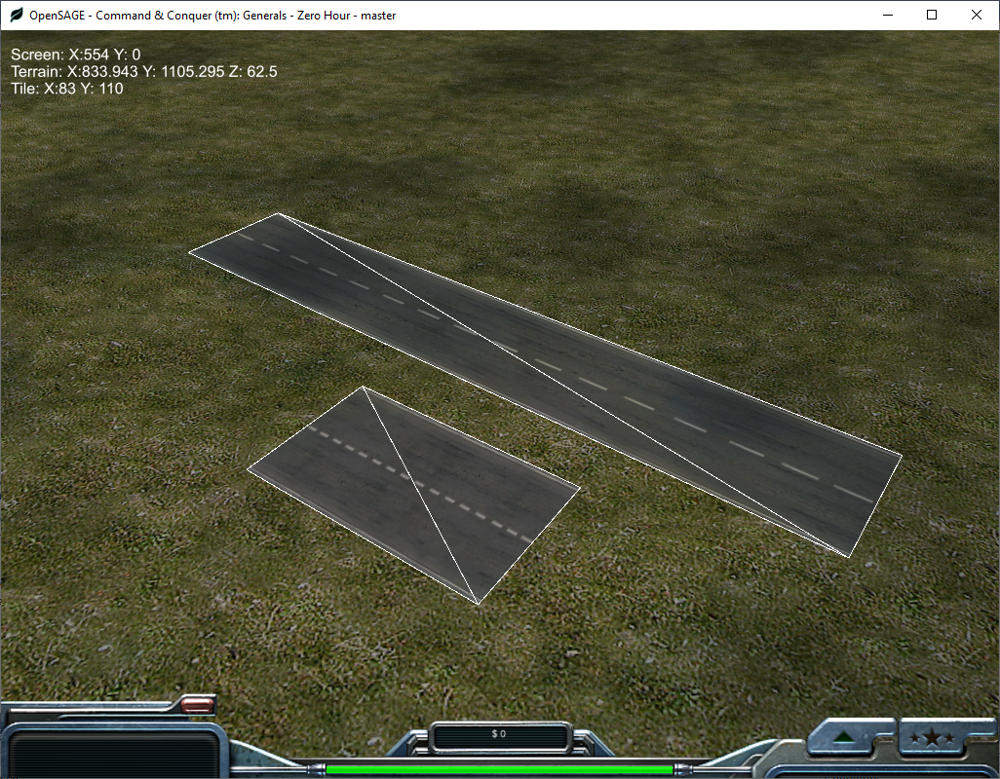
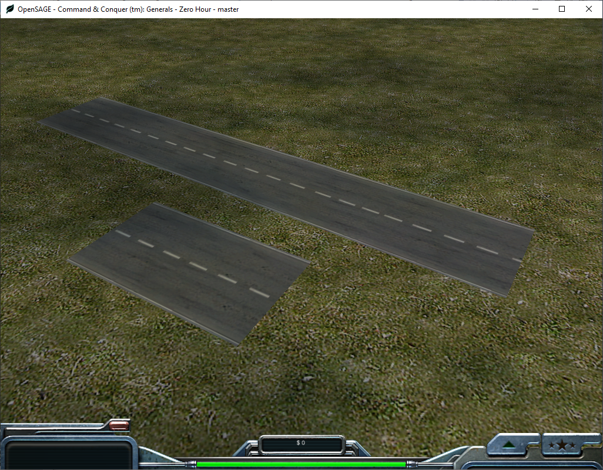

Figuring out how to render the roads correctly in OpenSAGE turned out to be a little more challenging than expected. This is the fourth post in a series describing the journey. After converting the point pairs we read from the map file to a graph data structure [in the previous post](/blog/roads-how-boring-part-3-building-a-graph-data-structure), we are finally ready to actually start rendering something.

Our goal is to generate a [triangle mesh](https://en.wikipedia.org/wiki/Triangle_mesh) and then put a texture on it. For the most simple straight road segment, we need two triangles that form a rectangle. We can enable the `Wireframe` mode in World Builder to see all the triangles the terrain and roads are made of (I colorized the road triangles so that they are more easily distinguishable from the terrain):



## Generating the geometry

The first step is to find the rectangle's corners' 3D coordinates in world space.



We already know the start and end position, so all we need to calculate A, B, C and D is the (half) road width. Different road types have different widths, so it must be derivable from the road type definition:

```ini
Road TwoLaneDarkDotted
  Texture = TRTwoLane6.tga
  RoadWidth = 35.0
  RoadWidthInTexture = 0.9
End
```

`RoadWidth` does sound promising...but how can we check if that's really the value used by the original engine? World Builder shows the 3D coordinates of the mouse cursor's position in the lower left corner, so one way would be to copy those and calculate the distance manually. Luckily for us, there's also a less cumbersome way: We can use the built in `Ruler` tool that's designed to measure distances in the map! We just need to drag a line and its length is displayed in the status bar:



So...the ingame road width seems to be about 31.5 feet, and not 35 as we suspected. It turns out the value we need to use is `RoadWidth * RoadWidthInTexture`.

Now we can calculate the positions A, B, C and D from the drawing above using vector arithmetic:

```csharp
var direction = Vector3.Normalize(End - Start);
var directionNormal = Vector3.Cross(direction, Vector3.UnitZ);
var toCorner = directionNormal * halfRoadWidth;
var A = Start + toCorner;
var B = End + toCorner;
var C = End - toCorner;
var D = Start - toCorner;
```

## Applying the texture

All that's left now is to apply the texture to the triangles. In order to do that, we need to assign [texture coordinates](https://docs.microsoft.com/en-us/windows/win32/direct3d9/texture-coordinates) to the points A-D. In other words, we need to find the coordinates of these points inside the road texture.



The straight road covers the top third of the texture. It stretches from the left (0) to the right (1) end, so the U coordinates are easy to determine. V is a little more complicated, because it depends on the `RoadWidthInTexture`. The middle of the road is fixed at the center of the top third: `(1/3) * 0,5 = 1,6666...`[^1].

A little more experimentation with different `RoadWidthInTexture` values tells us that an unscaled (`RoadWidthInTexture = 1`) road's width is exactly `1/4` or `0.25` in texture space. So for our `TwoLaneDarkDotted` road we end up with the following coordinates:

|Position|U|V|
|---|---|---|
|A|`0`|`1.666 - 0.25 * 0.9`|
|B|`1`|`1.666 - 0.25 * 0.9`|
|C|`1`|`1.666 + 0.25 * 0.9`|
|D|`0`|`1.666 + 0.25 * 0.9`|

Now we finally have everything we need to render straight roads...and it works!



Well...it kind of works. The road segments have different lengths, and our current implementation always stretches the texture to cover the whole length. That doesn't look right.

## Repeating the texture

In order to fix this problem, we need to _repeat_ the texture instead of stretching it. We can easily do that by specifying values greater than 1 for the U coordinate.

We know that an unscaled road width is `0.25` in texture space, and that the texture length is `1` in texture space. The unscaled road width in world space is given by `RoadWidth`, so the texture length in world space must be `4 * RoadWidth`. We can calculate the new U coordinates by dividing the road segment's length by this value:

|Position|U|V|
|---|---|---|
|A|`0`|`1.666 - 0.25 * 0.9`|
|B|`Segment length / (4 * RoadWidth)`|`1.666 - 0.25 * 0.9`|
|C|`Segment length / (4 * RoadWidth)`|`1.666 + 0.25 * 0.9`|
|D|`0`|`1.666 + 0.25 * 0.9`|

Et voilà (this time without triangle overlay):



The segments are still disconnected of course...we'll tackle that next time.

[^1]: When we try to use this value, the textures are still a little off. Apparently the original engine used a truncated constant of `1.666` as an approximation.